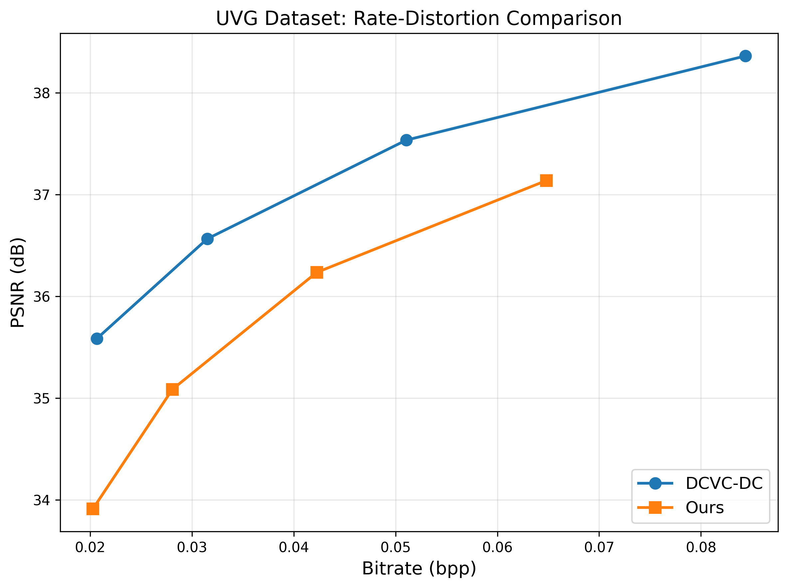

# opendcvcs-dcvc-dc

A from-scratch reproduction of **DCVC-DC** (Li et al., *Neural Video Compression
with Diverse Contexts*, CVPR 2023): a **training pipeline**
together with **pretrained weights**.

The official DCVC-DC release ships inference code and weights but **no training
code**; the open-source [opendcvcs](https://gitlab.com/viper-purdue/opendcvcs)
pipeline ships training code but **no weights**. This repository releases *both
together*.

## What's in this repository

| Path | Description |
|---|---|
| `train.py` | 4-stage pretraining + finetuning of the DCVC-DC P-frame model, with multi-GPU support (PyTorch DDP) |
| `test_video.py` | Evaluation on UVG / HEVC test sequences (P-frame and overall metrics) |
| `DCVC-DC/` | Model code (motion + residual branches, entropy models, and the C++ rANS coder under `DCVC-DC/cpp/`) |

**Pretrained weights are not stored in git** (see `.gitignore`). Two checkpoints
are needed:

| Checkpoint | What it is | Where to get it |
|---|---|---|
| `dcvc-dc.pth` | DCVC-DC **P-frame** model — trained in this repo | [Release v1.0](https://github.com/pohlni/opendcvcs-dcvc-dc/releases/tag/v1.0) |
| `cvpr2023_image_psnr.pth.tar` | Frozen **IntraNoAR I-frame** model — Microsoft's original weights | [Microsoft DCVC](https://github.com/microsoft/DCVC) |

The I-frame model is **not redistributed here** — download it from the official
Microsoft DCVC release, which is its original source. The P-frame model is
published as a GitHub release asset:

```bash
wget https://github.com/pohlni/opendcvcs-dcvc-dc/releases/download/v1.0/dcvc-dc.pth
```

## Modifications to opendcvcs

The model code comes from upstream [opendcvcs](https://gitlab.com/viper-purdue/opendcvcs).
The changes are:

- **Multi-GPU training** — added a distributed (multi-GPU) training pipeline
  with PyTorch `DistributedDataParallel` for faster training.
- **BPP normalization fix** — upstream divided the bit count by the pixels per
  frame but not by the batch size, inflating rate estimates when training
  multiple sequences per step; added the missing `batch_size` divisor.

As in opendcvcs, the model is trained in **4 phases** (motion warm-up → residual
training → rate term → end-to-end). See the
[opendcvcs](https://gitlab.com/viper-purdue/opendcvcs) repository for the full
training details.

## Results

UVG rate-distortion, DCVC-DC (official) vs. ours:



## Acknowledgements

This repository builds on two prior works, and the model code under `DCVC-DC/` is
derived from them and retains their MIT license:

- **[DCVC-DC](https://github.com/microsoft/DCVC)** (Microsoft Research) — the
  original model and the intra-frame weights.
- **[opendcvcs](https://gitlab.com/viper-purdue/opendcvcs)** (Purdue VIPER Lab) —
  the open-source training pipeline.

